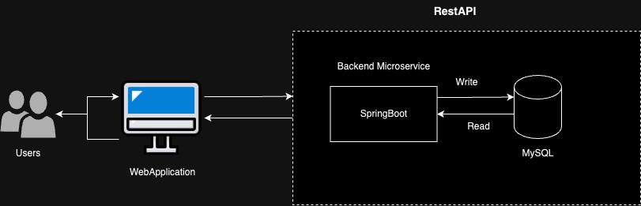

## Introduction

The objective of this project is to develop a web application that provides user registration and login functionalities. Users will be able to create new accounts by registering with their personal information and login securely to access the application's features.

## Functional Requirements

**User Registration:**

    * Users can create new accounts by providing their personal details, including name, email address, password, etc.
    * Input validation ensures that only valid data is accepted during registration.
    * Passwords are securely hashed on the server before storage.
    * Upon successful registration, users receive confirmation and can proceed to login.

**User Login:**

    * Registered users can securely login to the application using their email address and password.
    * Passwords are hashed and compared with stored hashes for authentication.

## Technologies Used
    * Frontend: HTML, CSS, JavaScript
    * Backend: Spring Boot(Java)
    * Unit Test: Junit, Mockito 
    * Database: SQL
    * Security: Encryption techniques (e.g., bcrypt for password hashing) to ensure data security and prevent unauthorized access

## Architecture Overview

**Frontend Development**

    * Front end is developed with HTML ,CSS.
    * Input validations for the forms and appropriate error messages for invalid inputs done through Javascript.

**Backend Development**

    * Data from front end is sent through Rest Api.
    * Upon receiving data, Spring Boot handles it by processing and then storing it in the database through the JPA repository.

**Data Flow**
User Registration Flow:

    * Frontend sends a registration request to the backend with user-provided data.
    * Backend validates the input data, generates a unique user ID, and stores the user details in the database.
    * Backend sends a confirmation response to the frontend, indicating successful registration
 
User Login Flow:

    * Frontend sends a login request to the backend with user credentials (email and password).
    * Backend verifies the credentials against the database
    * Backend sends a confirmation response to the frontend, indicating successful login.
 

 